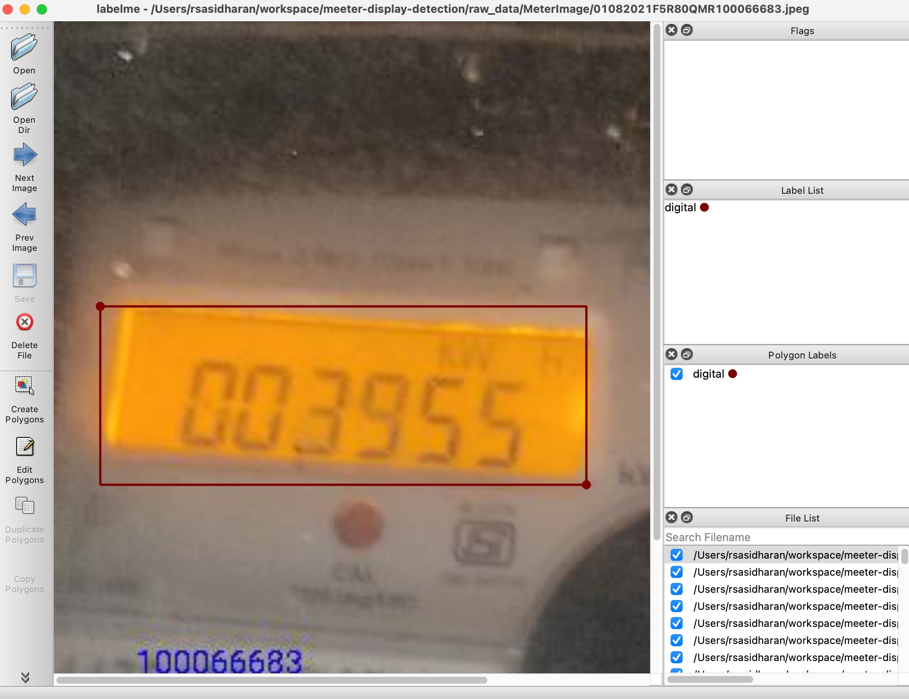
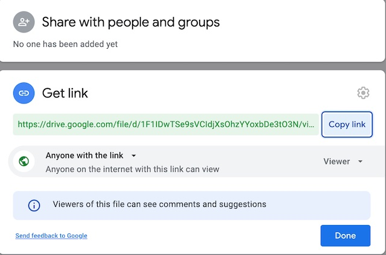

### How to train display detection model?
#### Clone this repo
Open a terminal and run
```
git clone https://github.com/renjithsasidharan/meeter-display-detection.git
```
#### Create annotations
  Training data is present in `raw_data/MeterImage` folder. If you want to add more training data, you can copy images to `raw_data/MeterImage`.

  Once new images are added to `raw_data/MeterImage`, you need to annotate the image with its bounding boxes.

  To create bounding boxes, you have to install https://github.com/wkentaro/labelme. After you install `labelme`, open `labelme` and start annotating the new images you added to `raw_data/MeterImage`.

  1. Right click on image and select `Create Rectangle` to create bounding box
  2. Select `digital` as label
  3. Click `Save` to save annotation

  

#### Create training data
  1. Open a terminal and `cd` to `meeter-display-detection` directory
  2. Install dependency Pillow
      ```
      pip install Pillow
      ```
  3.  Create training data
      ```
      python createbb.py
      ```
      This will create training and test data in `raw_data/training_data`
  4. Create an archive file of `training_data` folder and name it `training_data.zip`. The contents of `training_data.zip` should be `train` and `test`folder.

#### Train model on google Colab
  1. Upload the `training_data.zip` to google drive.
  2. Share the file as `Anyone with link can view this file`. This is needed later since we will download this file in google colab.
  
  3. Go to https://colab.research.google.com/
  4. Upload the `notebook meeter_reader_mobilenetv2_v1.ipynb` from this repo to google Colab
  5. Select GPU as runtime in Colab
  6. Execute the notebook in Colab
  7. Once the training is over, the browser will automatically download file `model.tflite`. This is the trained model.


